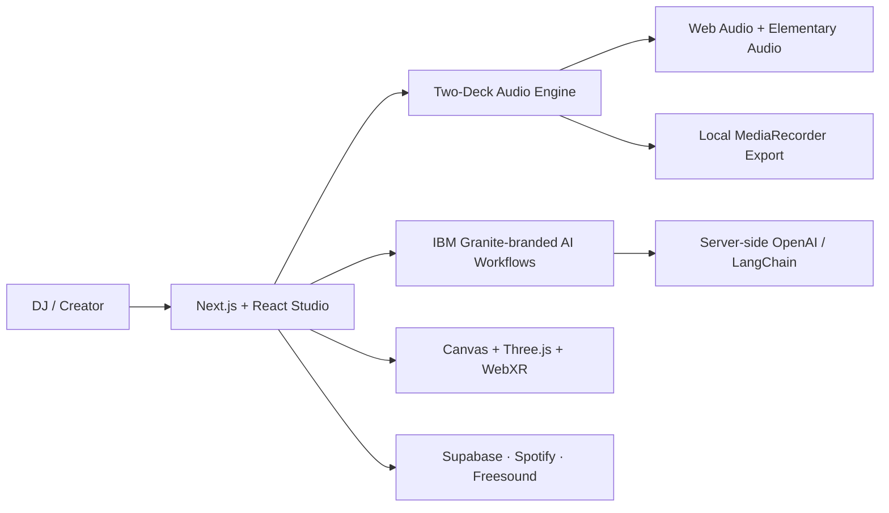

<p align="center">
  
</p>

<p align="center">
  
</p>

<p align="center">
  <strong>A browser-based, AI-assisted DJ workspace for learning, creating, mixing, visualizing, and performing.</strong>
</p>

<p align="center">
  
  
  
  
  
</p>

## What Is AI DJ Studio?

AI DJ Studio turns a web browser into an approachable two-deck DJ environment. It combines real browser audio controls, guided learning, AI-assisted creative planning, reactive visuals, performance feedback, music discovery, recording, and an immersive VR stage in one application.

It is designed to shorten the distance between *wanting to DJ* and *actually practicing*. New DJs can learn what each control does, creators can develop complete set ideas, and performers can test transitions without installing traditional desktop DJ software.

> The AI Creative experience is branded as **IBM Granite** in the interface and currently uses the configured OpenAI service as its underlying inference provider.

## The Problem It Solves

Learning to DJ often requires expensive software, unfamiliar hardware terminology, a personal music library, and enough theory to understand BPM, phrasing, EQ, keys, and energy. Static tutorials explain these ideas separately, but they rarely let a learner practice them immediately.

AI DJ Studio brings those pieces together:

- Learn a concept and try it on the decks immediately.
- Receive explanations for BPM, harmonic compatibility, phrase timing, and transitions.
- Develop a performance concept before selecting tracks.
- Load local audio, practice a mix, record it, and review the result.
- Explore visual, VR, streaming, and creative workflows from the same interface.

## Who Uses It?

| User | How AI DJ Studio helps |
| --- | --- |
| Beginner DJs | Guided onboarding, lessons, cue/loop practice, and understandable AI recommendations. |
| Bedroom DJs | A portable practice deck for local tracks, transitions, FX, hot cues, and recordings. |
| Music creators | Beat editing, remix prompts, mood boards, artwork briefs, and set-story development. |
| Event and club DJs | Event-aware set planning, energy progression, BPM/key paths, and transition strategies. |
| Students and educators | A visual teaching environment for rhythm, EQ, harmonic mixing, and performance structure. |
| Visual performers | Audio-reactive visual concepts, cyberpunk scenes, 3D visualization, and VR staging. |

## How It Helps

### Learn by doing

The interactive tutorial introduces real controls rather than showing a disconnected slideshow. The Learn DJ area combines explanations, quizzes, and playable lessons, while the AI assistant explains the musical reason behind its advice.

### Build better mixes

Deck A and Deck B support play/pause, cueing, seeking, hot cues, tempo, EQ, filtering, echo, reverb, loops, volume, and crossfading. Smart suggestions help users reason about BPM differences, harmonic movement, bass swaps, and phrase-aligned transitions.

### Turn ideas into complete performances

The AI Creative suite includes purpose-built workflows for creative direction, collaboration, mood generation, story mixes, learning feedback, visual planning, complete set planning, artwork, inspiration, and performance insights.

### Practice without surrendering your files

Local tracks are decoded and played in the browser. Mix recording uses the browser audio graph and downloads the result locally; it does not require uploading the recording to a remote server.

## Core Experiences

### DJ Deck and Mixer

- Two working decks with waveform seeking and track analysis.
- Cue points, hot cues, pitch/tempo, 4/8/16-beat loops, EQ, filters, echo, and reverb.
- Channel volume, master volume, and crossfader controls.
- Drag-and-drop track loading, local recording, and keyboard control.
- BPM/pitch calculations and smart transition guidance.

### IBM Granite AI Creative Suite

- **Creative Studio:** set concepts, genre blends, BPM journeys, harmonic paths, and performance direction.
- **Creative Partner:** context-aware help with next-track roles, energy changes, intros, FX, and transitions.
- **Mood Generator:** converts an event or feeling into music, visual, lighting, and performance direction.
- **Story Mix:** creates a seven-act set from introduction through final drop and outro.
- **Learning Coach:** analyzes available deck evidence and identifies measurable limitations honestly.
- **Visual Studio:** maps bass, mids, treble, beats, and energy to visual behavior.
- **Set Planner:** builds timed chapters with BPM, keys, track roles, transitions, and contingencies.
- **Album & Poster:** generates art direction and exports editable branded SVG artwork.
- **Inspiration Board:** creates transition experiments, remix exercises, stage ideas, and daily challenges.
- **Performance Insights:** provides evidence-based analysis without inventing unavailable audience data.

### Learning and Onboarding

- Ten-step deck tutorial tied to the real interface.
- Learn DJ quizzes and playable lesson videos.
- Compact chroma-keyed presenter video after tutorial completion.
- Optional keyboard-shortcut manual and persistent learning preferences.

### Visuals and VR

- Cyberpunk City, spectrum, waveform, and 3D ring visualizers.
- Audio-reactive lighting and stage effects.
- Outdoor sunset VR stage with the Pioneer-style GLB console.
- In-world Deck A/B play controls and interactive jog-wheel seeking.
- Desktop orbit controls plus WebXR headset entry when supported.

### Library, Streaming, and Creation

- Local and preloaded music workflows.
- Spotify OAuth playlist browser.
- Freesound search, preview, sorting, and deck loading.
- Browser music editor for cutting and merging WAV output.
- Experimental filtered vocal, drum, and bass stem previews.

## How the Application Works



## Technology Stack

- **Application:** Next.js App Router, React 19, TypeScript, Tailwind/PostCSS.
- **Audio:** Web Audio API, Elementary Audio, Tone.js, MediaRecorder, OfflineAudioContext.
- **AI:** server-side OpenAI through LangChain with specialized creative prompts.
- **3D and VR:** Three.js, React Three Fiber, Drei, WebXR, GLB assets.
- **Computer vision:** MediaPipe Tasks Vision for emotion/camera experiences.
- **Authentication:** Supabase email/password and Google/GitHub OAuth.
- **Music services:** Spotify OAuth and Freesound server proxy.
- **Persistence:** IndexedDB and localStorage for browser-owned state.

## Getting Started

### Prerequisites

- Node.js 20 or newer
- npm
- A modern Chromium, Firefox, or Safari browser

### Install and run

```bash
git clone https://github.com/Ninjaboy249/AI-DJ-STUDIO-APP.git
cd AI-DJ-STUDIO-APP
npm install
npm run dev
```

Open [http://localhost:3000](http://localhost:3000).

### Validation

```bash
npm run typecheck
npm run build
```

## Environment Variables

Create `.env.local` in the project root. Configure only the integrations you intend to use.

```env
OPENAI_API_KEY=
NEXT_PUBLIC_SUPABASE_URL=
NEXT_PUBLIC_SUPABASE_ANON_KEY=
NEXT_PUBLIC_SPOTIFY_CLIENT_ID=
SPOTIFY_CLIENT_SECRET=
FREESOUND_API_KEY=
SMTP_HOST=smtp.gmail.com
SMTP_PORT=587
SMTP_USER=
SMTP_PASS=
SUPPORT_TO_EMAIL=
```

Secrets remain on server routes. Do not commit `.env.local`.

## API Routes

| Route | Purpose |
| --- | --- |
| `POST /api/ai/chat` | DJ copilot replies and suggestions. |
| `POST /api/ai/creative` | Specialized AI Creative module generation. |
| `POST /api/ai/beat` | AI-assisted beat specification. |
| `POST /api/ai/crowd` | Crowd-mood interpretation and recommendations. |
| `POST /api/ai/fx` | Timed DJ effect generation. |
| `POST /api/ai/mood-tracks` | Mood-aware track support. |
| `POST /api/ai/recommend` | Track recommendation support. |
| `POST /api/ai/voice` | Voice-command interpretation. |
| `GET /api/auth/callback` | Supabase OAuth callback. |
| `GET /api/auth/spotify/callback` | Spotify OAuth callback and token exchange. |
| `GET /api/freesound/search` | Server-side Freesound search proxy. |
| `POST /api/support` | Support and bug-report email submission. |

## Keyboard Shortcuts

Enable shortcuts in Studio Settings first.

| Shortcut | Action |
| --- | --- |
| `Space` | Deck A play/pause |
| `Shift + Space` | Deck B play/pause |
| `1`–`8` | Deck A hot cues |
| `Shift + 1`–`8` | Deck B hot cues |
| `Q` / `W` / `E` | Deck A 4 / 8 / 16-beat loops |
| `A` / `S` / `D` | Deck B 4 / 8 / 16-beat loops |

## Privacy and Integration Notes

- Local track playback and mix recording stay in the browser.
- OpenAI keys remain server-side and are never intentionally exposed to client components.
- Spotify client secrets and Freesound credentials are handled by server routes.
- Supabase manages authenticated sessions and configured OAuth providers.
- Browser and headset capabilities vary; WebXR controls degrade to the desktop 3D view when unavailable.
- AI guidance supports creative decisions but does not replace listening, licensing checks, or performer judgment.

## Future Roadmap

- Immersive VR 3D mode with interactive Pioneer-style DJ decks, mixer controls, spatial navigation, and headset support.
- Full pad implementation for cue, loop, sample, and FX modes.
- Real-world lesson scenarios and mini games for learning DJ timing.
- SoundCloud integration.
- More complete Spotify playlist loading.
- DJ community chat for sharing beats and playlists.
- DJ leaderboard and practice streaks.
- Mood-based beat generation.
- Stronger login/account flow with profile persistence.
- Beat Maker upgrades for crop, cut, merge, beat making, and arrangement.
- Neural stem separation using WebNN or a lightweight TensorFlow.js model.
